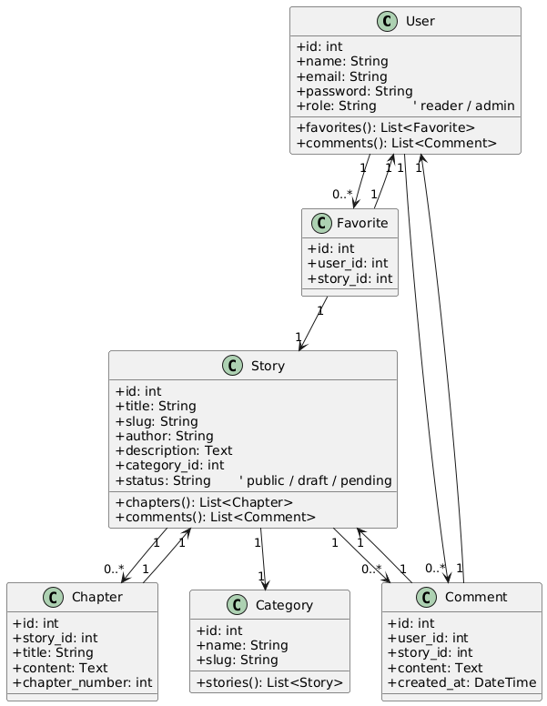
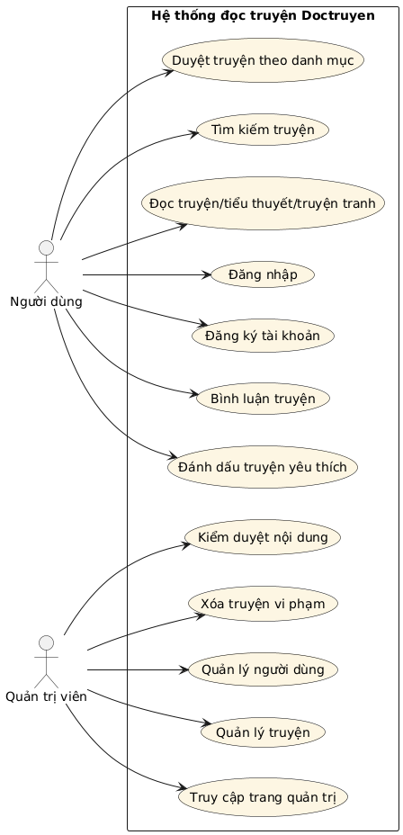
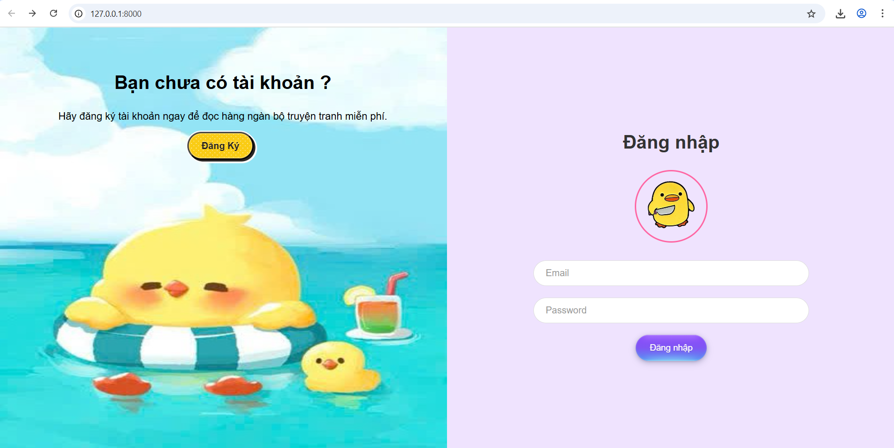
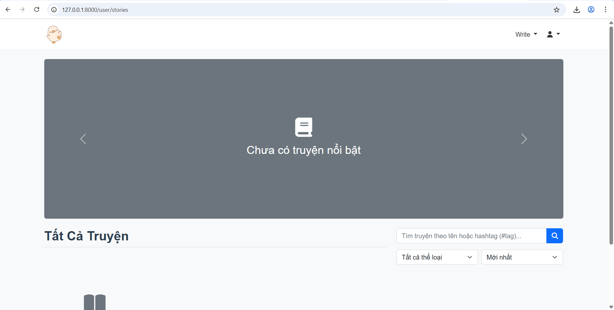
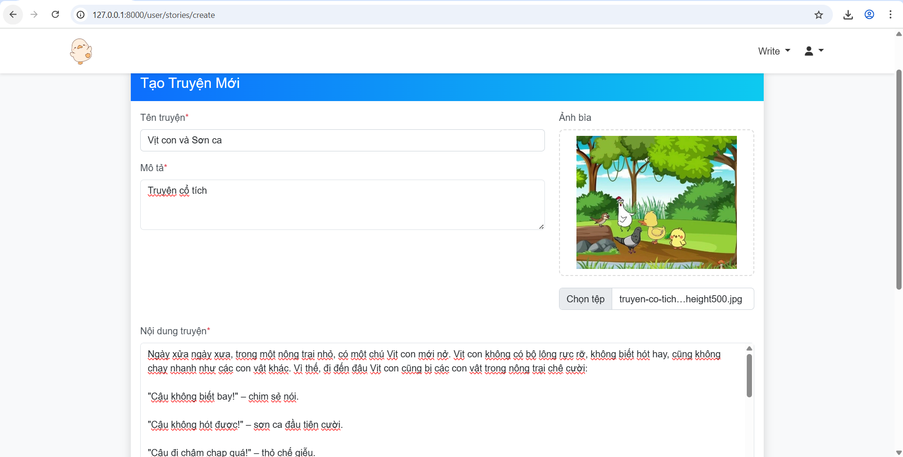
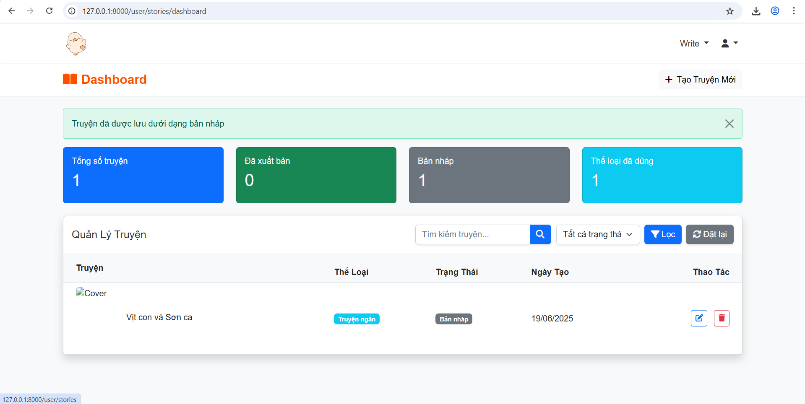
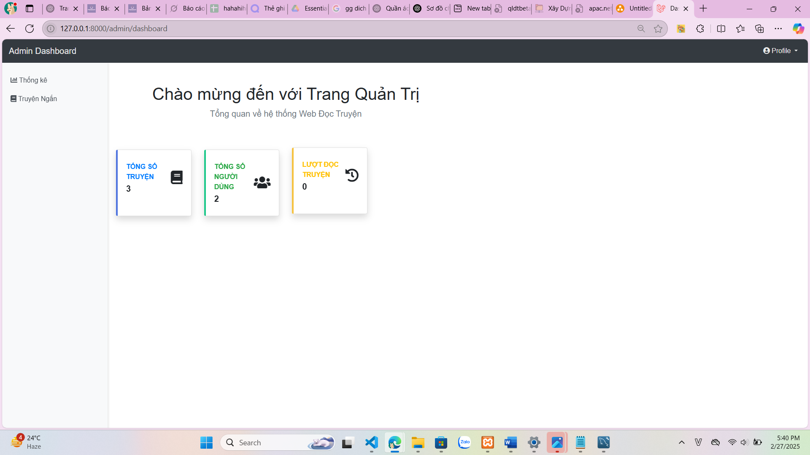

# Doctruyen

Ứng dụng web để đọc truyện, tiểu thuyết, và truyện tranh trực tuyến. Doctruyen cung cấp giao diện thân thiện cho người đọc để khám phá và thưởng thức nội dung.

## Tính năng

- Hệ thống xác thực người dùng
- Duyệt truyện theo danh mục
- Đánh dấu truyện yêu thích
- Chức năng tìm kiếm

## Cài đặt

```bash
# Sao chép kho lưu trữ
git clone https://github.com/yourusername/doctruyen.git

# Di chuyển đến thư mục dự án
cd doctruyen

# Cài đặt các phụ thuộc
composer install
npm install

# Sao chép tệp môi trường
cp .env.example .env

# Tạo khóa ứng dụng
php artisan key:generate

# Cấu hình cơ sở dữ liệu trong tệp .env
# Sau đó chạy migrations
php artisan migrate

# Biên dịch tài nguyên
npm run dev
```

## Sử dụng

```bash
# Khởi động máy chủ phát triển cục bộ
php artisan serve
```

Truy cập `http://localhost:8000` trong trình duyệt của bạn để sử dụng ứng dụng.

## Biểu đồ database Class diagram


## Biểu đồ database Usecase diagram



## Công nghệ

- Laravel
- MySQL
- Vue.js/React (Framework Frontend)
- Tailwind CSS

## Hình ảnh trang web
### Đăng nhập 

### Giao diện người dùng



### Giao diện admin



### 

## Giấy phép

Phân phối theo Giấy phép MIT. Xem `LICENSE` để biết thêm thông tin.

